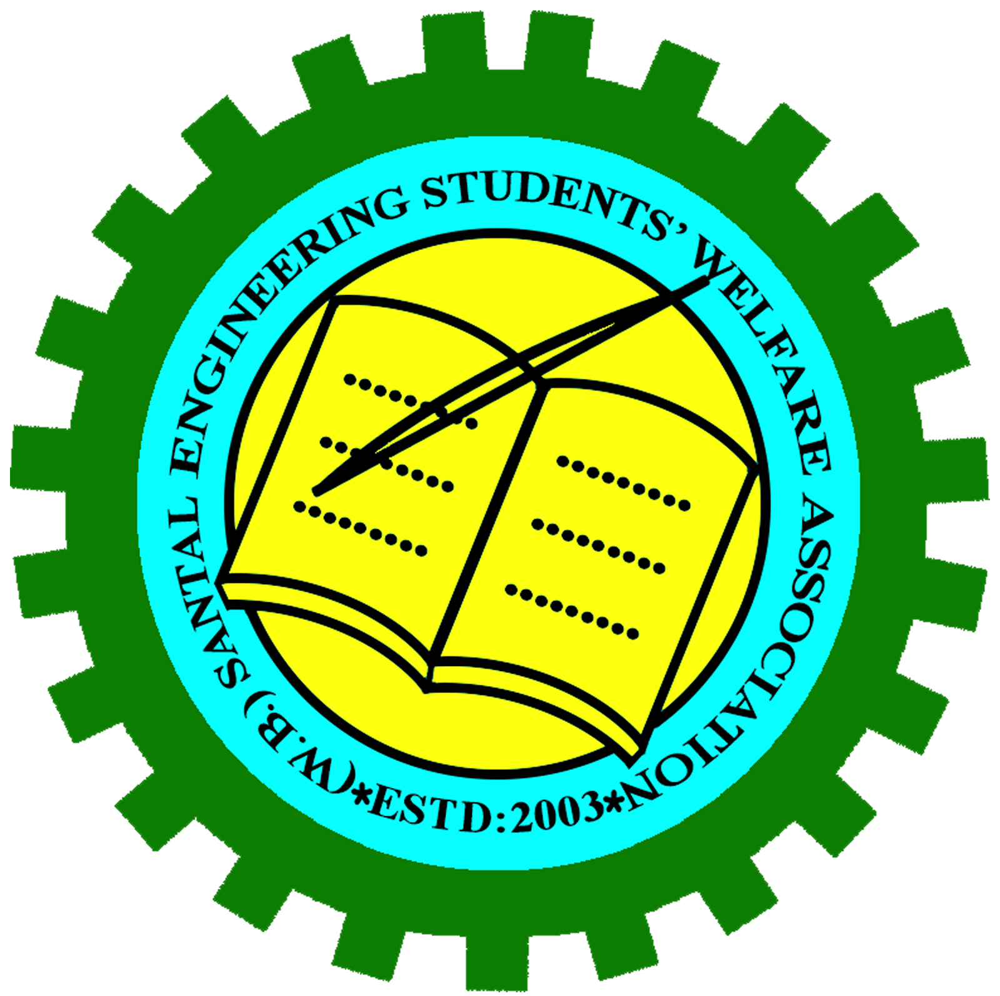

# 📱 SESWA - Digital Registration & Event Management System



> **S**mart **E**vent **S**ystem for **W**eb **A**ttendance.
> A modern, secure, and real-time digital registration platform built for efficient event management.

---

## 🚀 Overview

**SESWA** is a full-stack Next.js application designed to streamline the attendance process for large-scale events. It replaces traditional paper-based registration with a fast, QR-code-based digital system.

The system allows students to register online and generate a unique QR code. Event representatives can then use the built-in scanner to verify participants and manage meal distribution (Breakfast, Lunch, Dinner) in real-time, syncing all data instantly to a centralized cloud database.

## ✨ Key Features

### 👤 For Participants (Students)
- **Instant Registration**: Simple form to collect details (Name, College, Food Preference).
- **QR Code Generation**: Generates a unique, secure QR token upon registration.
- **Privacy Focused**: Explicit consent required for data processing.
- **Mobile Friendly**: Fully responsive design for easy access on smartphones.

### 🛡️ For Representatives (Admins)
- **Secure Access**: Restricted login system with 4 dedicated secure accounts.
- **Live QR Scanner**: Built-in camera scanner (supports environment facing cameras).
- **Manual Entry**: Fallback option to enter Token IDs manually.
- **Real-Time Dashboard**: Live statistics on total attendees and meals served.
- **Meal Management**: One-click tracking for Lunch/Dinner distribution (prevents duplicates).
- **Profile View**: View detailed participant info (Activity logs, Accommodation status).

---

## 🛠️ Technology Stack

- **Framework**: [Next.js 15](https://nextjs.org/) (App Router)
- **Language**: [TypeScript](https://www.typescriptlang.org/)
- **Styling**: Native CSS Modules (Performance optimized)
- **Database**: [MongoDB Atlas](https://www.mongodb.com/atlas) (Cloud NoSQL)
- **ORM**: [Mongoose](https://mongoosejs.com/)
- **QR Utilities**: `qrcode.js`, `jsQR`
- **Security**: Next.js Middleware, CSP Headers, Input Sanitization

---

## ⚙️ Installation & Setup

Follow these steps to run the project locally.

### Prerequisites
- Node.js (v18+)
- MongoDB Atlas Account (Connection String)

### 1. Clone the Repository
```bash
git clone https://github.com/indra4626/seswa-registration-app.git
cd seswa-registration-app
```

### 2. Install Dependencies
```bash
npm install
```

### 3. Environment Configuration
Create a `.env.local` file in the root directory and add your MongoDB connection string:

```env
# .env.local
MONGODB_URI=mongodb+srv://<username>:<password>@cluster.mongodb.net/?retryWrites=true&w=majority
```

*(Note: Replace `<username>` and `<password>` with your actual MongoDB credentials)*

### 4. Run the Development Server
```bash
npm run dev
```

Open [http://localhost:3000](http://localhost:3000) with your browser to see the result.

---

## 📖 Usage Guide

### 1. Student Registration
- Navigate to `/student`.
- Fill in the required details (Name, College, WhatsApp, etc.).
- Check the consent box.
- Click **"Generate QR Code"**.
- Save or screenshot the generated QR code.

### 2. Representative Login
- Navigate to `/login`.
- Use one of the system-provisioned credentials.
- Upon success, you will be redirected to the Scanner Dashboard.

### 3. Scanning & Meal Service
- Navigate to `/scan`.
- Point the camera at a student's QR code.
- Once detected, the system pulls live data from MongoDB.
- Click **"Lunch"** or **"Dinner"** to mark the meal as served.
- **Note**: The system prevents double-serving for the same meal type.

---

## 🔒 Security Measures

- **Authentication**: Strict session checks; unauthenticated users are redirected from protected routes immediately.
- **Input Sanitization**: API inputs are sanitized to prevent NoSQL injection.
- **Secure Headers**: Implemented `middleware.ts` to add security headers like `X-Frame-Options`, `X-XSS-Protection`, and `Content-Security-Policy`.
- **Database**: IP Allowlisting configured for secure database access.

---

## 🤝 Contributing

This project is tailored for a specific event use case. However, contributions to improve scalability or UI are welcome.

1. Fork the Project
2. Create your Feature Branch (`git checkout -b feature/AmazingFeature`)
3. Commit your Changes (`git commit -m 'Add some AmazingFeature'`)
4. Push to the Branch (`git push origin feature/AmazingFeature`)
5. Open a Pull Request

---

## 📄 License

Distributed under the MIT License. See `LICENSE` for more information.

---

<p align="center">Made with ❤️ by the SESWA Tech Team</p>
